# Exploratory Data Analysis (EDA) - Overview

Before starting, we need to be familiar with every column of our data:
- Numerical data: `Age`,`Family member count`, `Account age`, `Income`, `Employment length`
- Cathegorical data: `Has a mobile phone`, `Has a work phone`, `Has a phone`, `Has a car`, `Has a property`, `Has an email`, `Gender`, `Employment status`, `Marital status`, `Dwelling`, `Job title`

The `Has a car` and `Has a property` features were mapped to {0,1} instead of {Y,N}. The columns `Age`, `Account age` and `Employment length` needs to be converted to years. 

## Target Column: Is high risk

The data exhibits a strong bias toward 'no risk' cases. This uneven distribution complicates the evaluation of high-risk predictive patterns

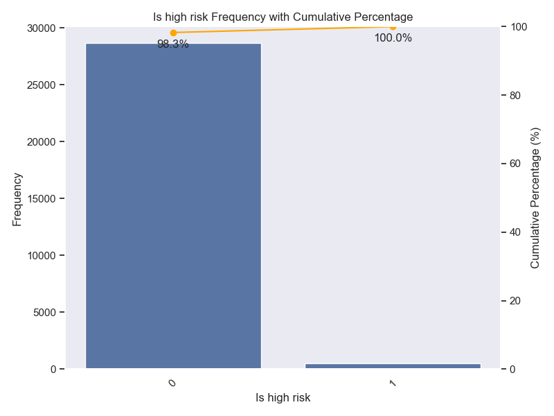

## Cathegorical data: distribution

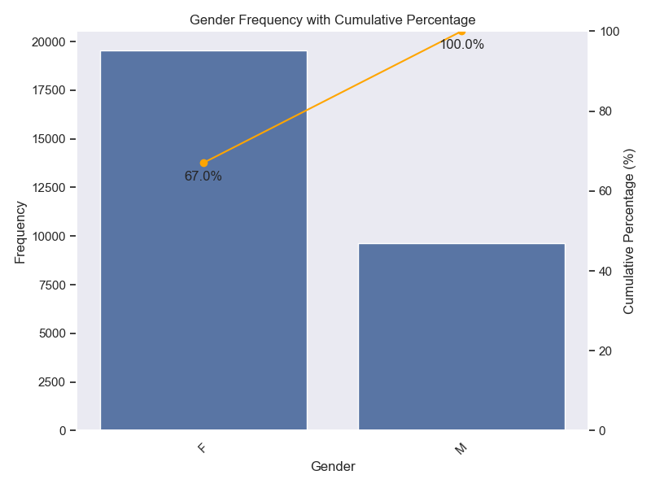
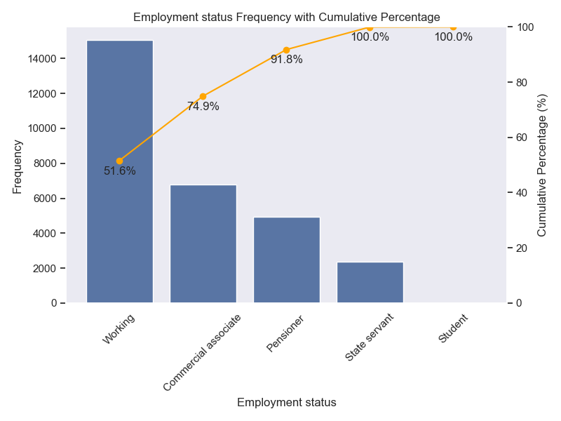
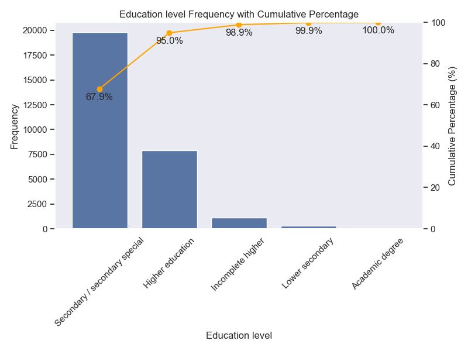
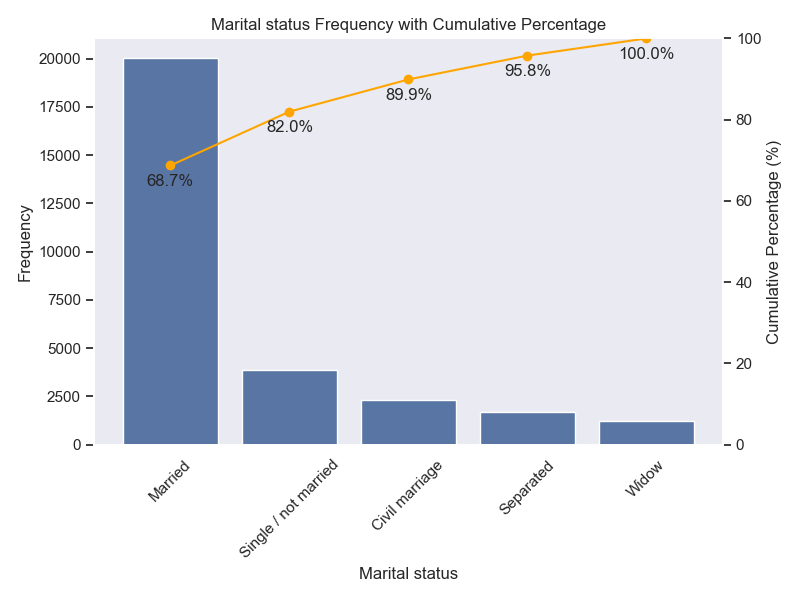
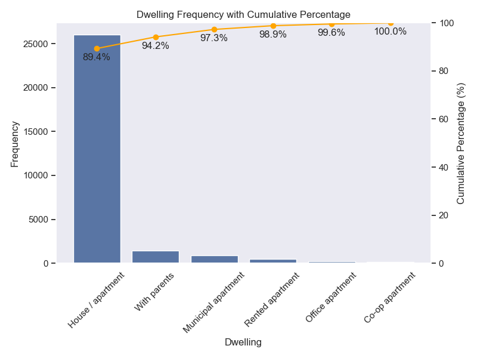
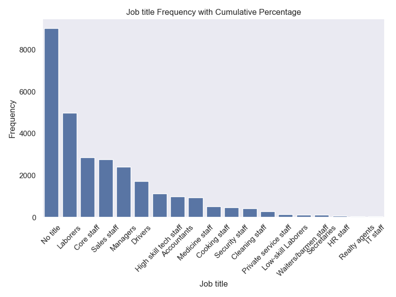
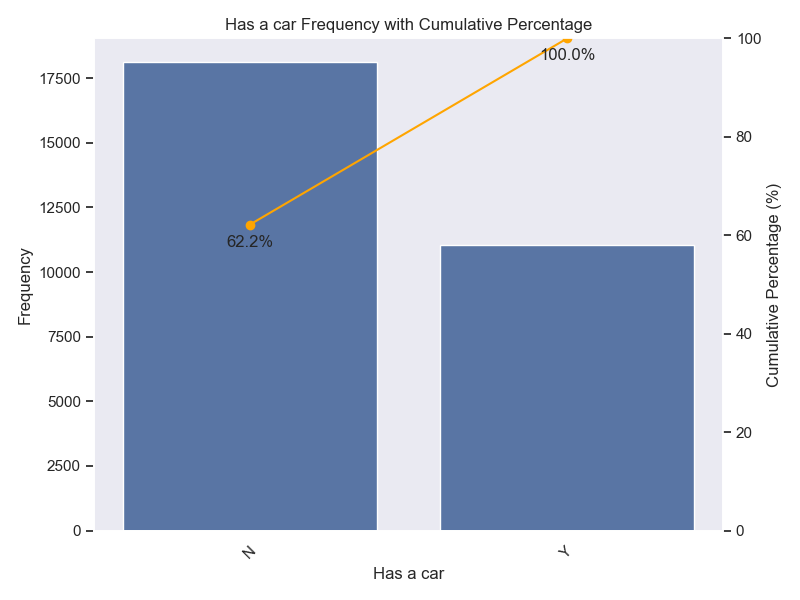
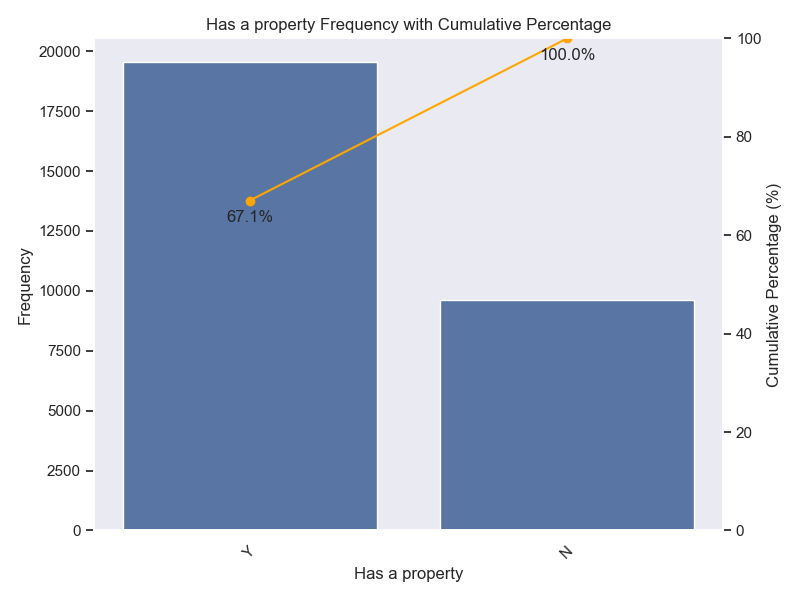
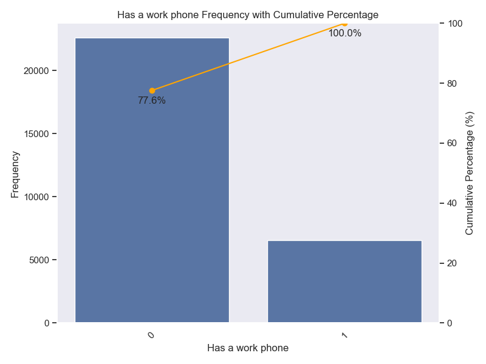
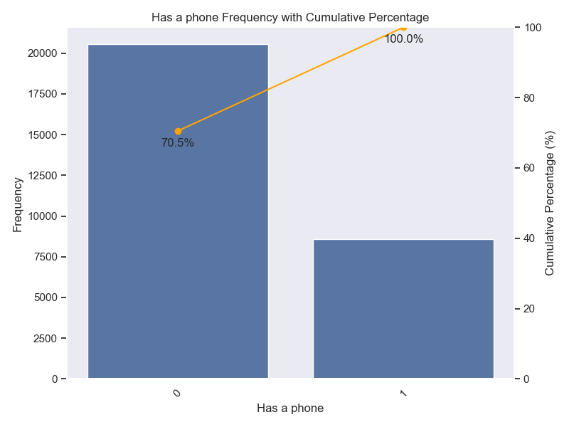
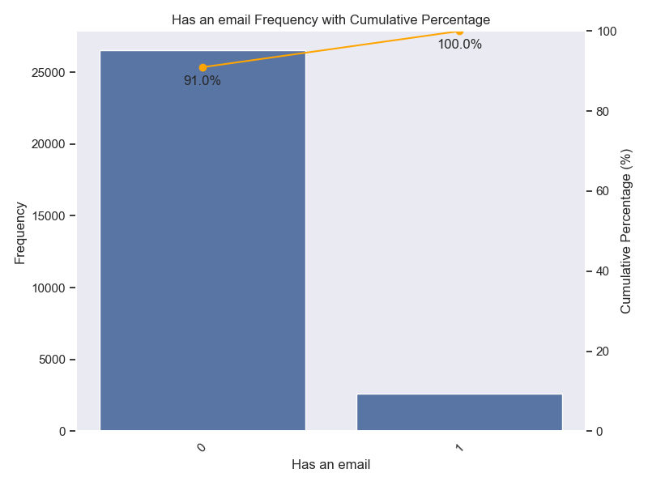

## Numerical data: distribution

Before start visualizing each column, we need to take a look into the correlation matrix

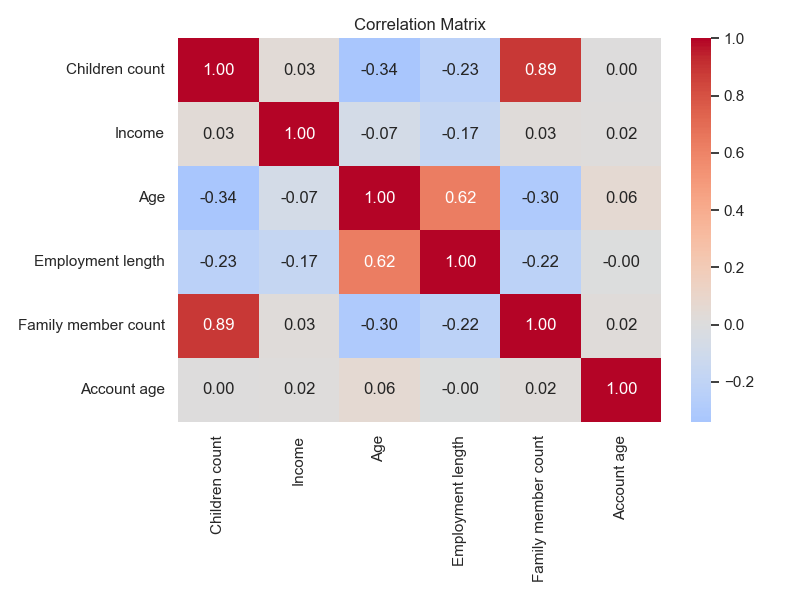

We see important correlations between:

- Family member count and Children count
- Age and Employment length
- Age and Children count
- Age and Family member count

Due to multicolinearity, I will drop Children count in this analysis since the family member count is already a good indicative.

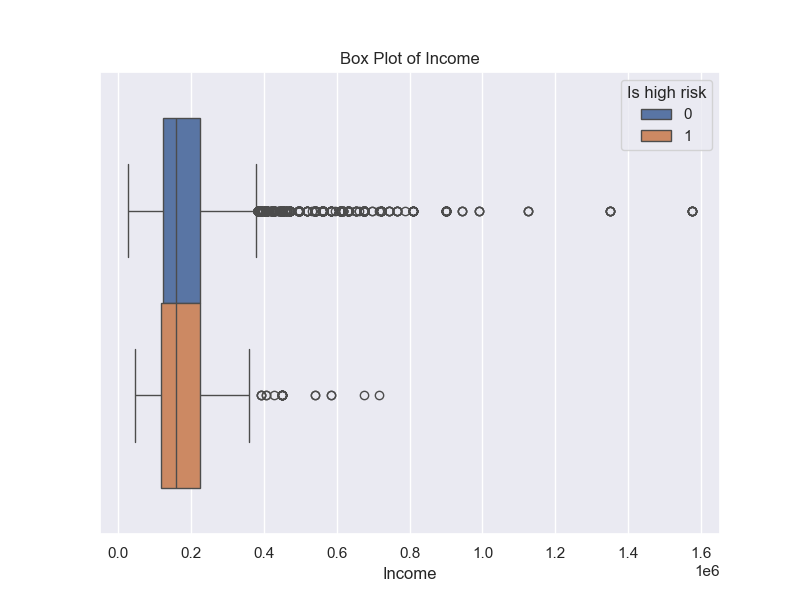
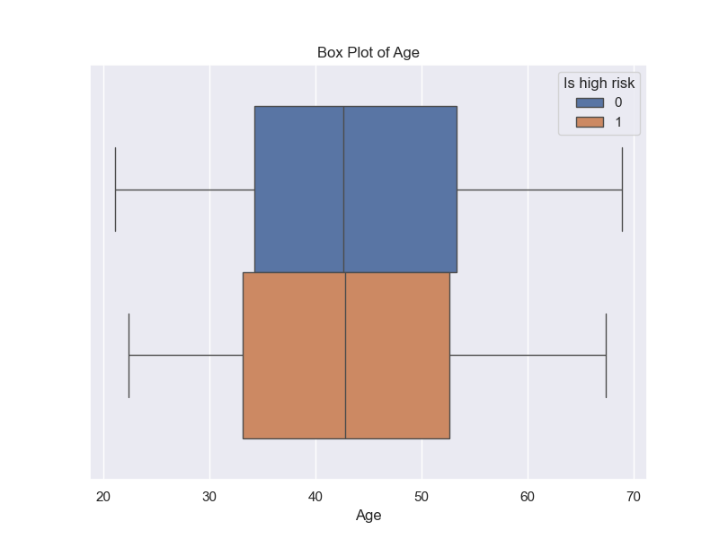

The employment length column has a clear outliner, with length more than 1000 years, that represent wrong data. This one will be removed.

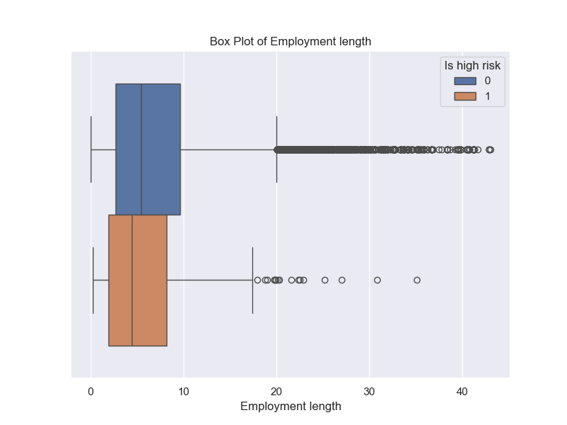
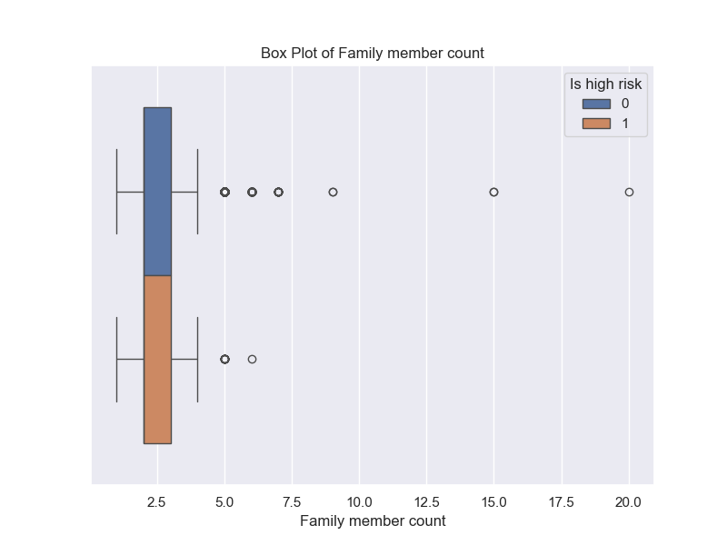
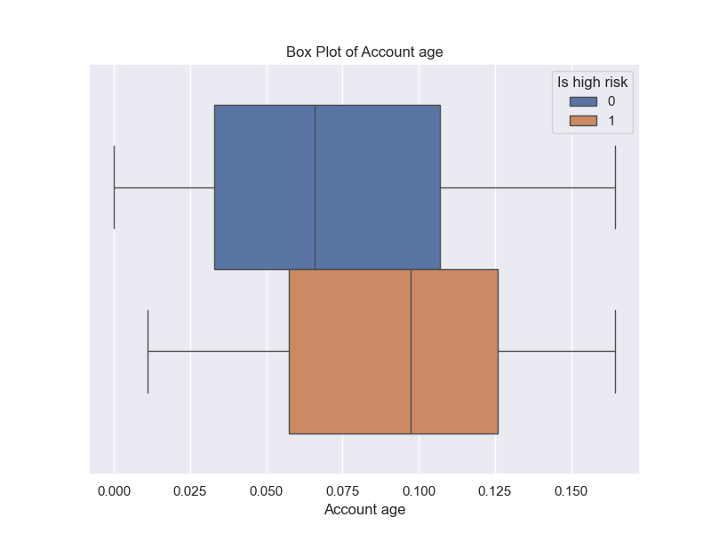

From the boxplot analysis, we see that `Income`, `Employment length` and `Family member count` has some natural outliers. These observations are classified as natural outliers, representing inherent socioeconomic variations rather than data entry errors."

## Comments

Preliminary analysis suggests that no single feature acts as a dominant predictor for the `is high risk` target variable. Following the data preprocessing and cleaning phases, the dataset is now structurally prepared for machine learning implementation.
